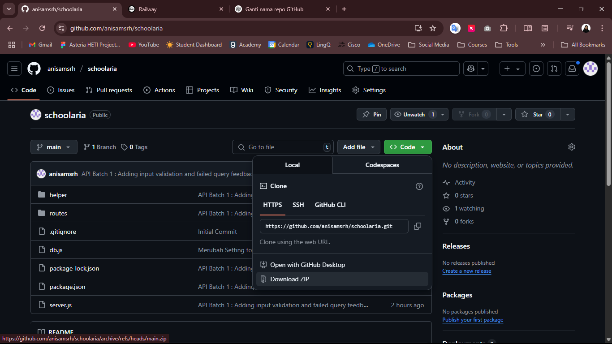

# SCHOLARIA API HANDLER 🎒✨
Scholaria merupakan website CRUD yang dapat digunakan untuk melakukan penilaian siswa secara digital. Proyek ini merupakan bagian dari tugas mata kuliah Basis Data.

Proyek ini merupakan Back-End part dari proyek Scholaria yang berisi API Handler serta starter database PosgreSQL. Agar bisa digunakan di lokal, bisa ikuti panduan di bawah ini!!

**LINK PENTING** \
🔗[link github] \
🔗[link postman]

# TUTORIAL PEMAKAIAN API DI LOKAL 🤔
## 1 : Download Resource
Download zip project (atau clone kalau mau) dan simpan hasil ekstraksi ke folder yang diinginkan

## 2 : Set Up Database
*di sini saya pakai GUI pgAdmin dan PosgreSQL, kalau mau menggunakan rdbms yang lain boleh saja
1. Buka pgAdmin PosgreSQL
2. Buat database kosong baru
3. Klik kanan database baru, dan pilih restore
4. Pada menu restore, pilih format "custom or tar" dan pilih file starter yang sudah didownload (ada di folder database-starter>>basdat-database)

5. Saran saya, pilih file dengan menekan icon folder agar lebih mudah
6. Klik tombol "Restore" untuk memulai import database
7. Database sudah berhasil diimport, silahkan coba beberpaa query

## 3 : Set Up API Handler
*untuk code editor, di sini saya pakai VS Code. Kalau pakai yang lain, bisa menyesuaikan
1. Patikan sudah install atau memiliki package node.js di komputer. \
Kamu bisa check dengan command `node -v` dan `npm -v`. Jika sudah terinstal, cmd akan mengembalikan versi npm dan node.js yang terinstall \
Jika belum, bisa cari tutorial internet ya😉
2. Mulai aplikasi VS Code dan buka folder tempat proyek berada
3. Buatlah file `.env` di root project yang berisi 
  - PORT=5000 (dibuat ini aja udh aman)
  - DB_HOST=localhost (g usah diganti)
  - DB_USER=???
  - DB_PASSWORD=???
  - DB_NAME=???
  - DB_PORT=5432 (pakai ini aja, yang default)\
  *\*Sesuaikan dengan pengaturan di komputer masing-masing*
3. Buka terminal dengan memilih pada menu atau bisa menggunakn ``CTRL + Shift + ` ``
4. Masukkan command `npm run install`
5. Setelah instalasi selesai, masukkan command `npm run start`
6. Server API sudah running di `localhost:5000`, untuk menggunakannya, bisa memakai Postman Collection yang tersedia
